# An Optometry Practice Website's Redesign

This is a redesign of my optometrist's website to be responsive and have a modern minimalist design (and look less early 2000's).

This was created just for fun to practice my web development skills.
_I am not associated with nor speak for this optometry practice._

**LIVE DEMO** - [optometrist.anniew.xyz](https://optometrist.anniew.xyz/) OR [optometrist-redesign.netlify.app](https://optometrist-redesign.netlify.app/)

    
    
    
    

    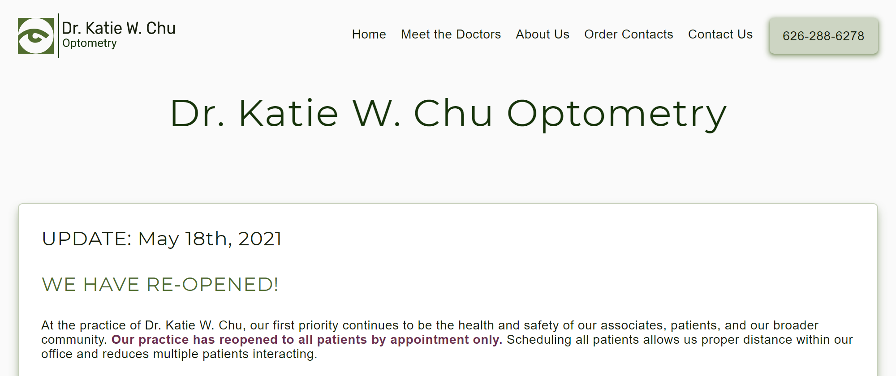

### Table of Contents

- [Design](#design)
  - [Fonts](#fonts)
  - [Color Scheme](#color-scheme)
  - [Overall Design](#overall-design)
- [New Design Wireframes vs. Original Design](#new-design-wireframes-vs-original-design)
  - [Home Page](#home-page)
  - [Meet the Doctors](#meet-the-doctors)
  - [About Us](#about-us)
  - [Order Contacts](#order-contacts)
  - [Contact Us](#contact-us)
- [Built With](#built-with)

## Design

Here are some of the design choices I made for this website.

### Fonts

[Monserrat](https://fonts.google.com/specimen/Montserrat) - page titles, section titles, headings

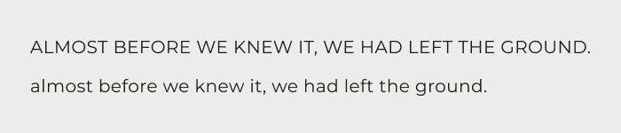

[Open Sans](https://fonts.google.com/specimen/Open+Sans) - everything else

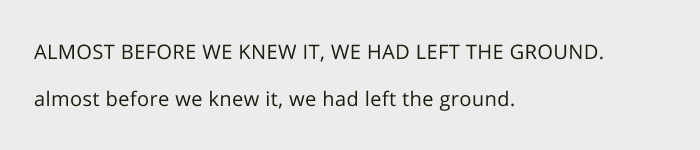

### Color Scheme

I decided to keep the original shade of green used in their logo and created a palette with shades of green and a complementary color for accent.

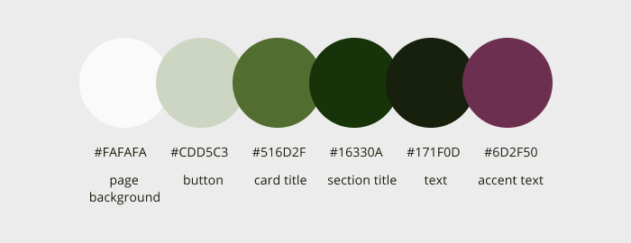

### Overall Design

I decided to change to a single page website with one column from the original multi-page website with static two columns. The left column which shows a bigger version of the logo and the location and hours under it can be fully removed. The new design is mobile first and can responsively change to fit wider screens with a max width of 1000px.

## New Design Wireframes vs. Original Design

These are the wireframes for a clean, modern, and minimalist look compared to the original design of the webpages.

### Home Page

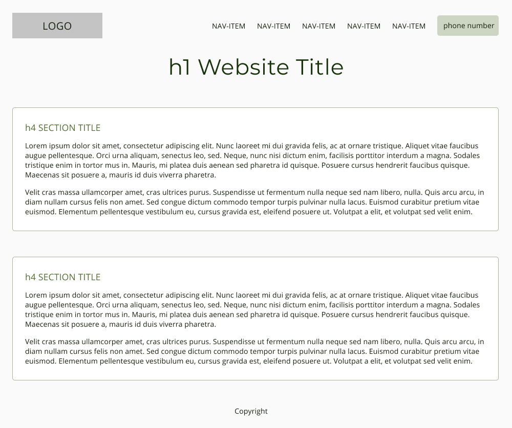
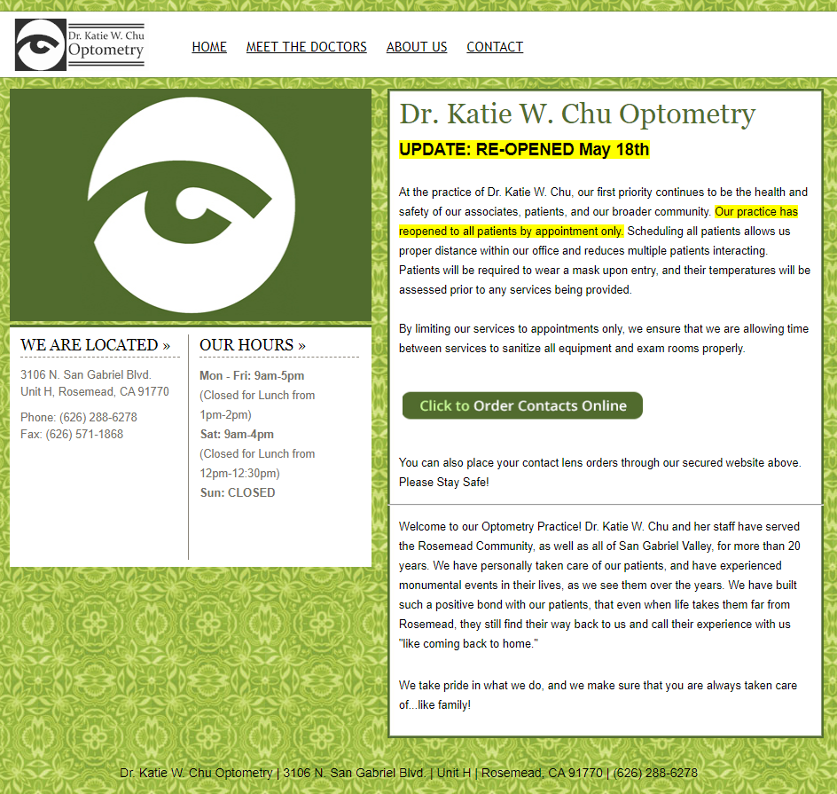

### Meet the Doctors

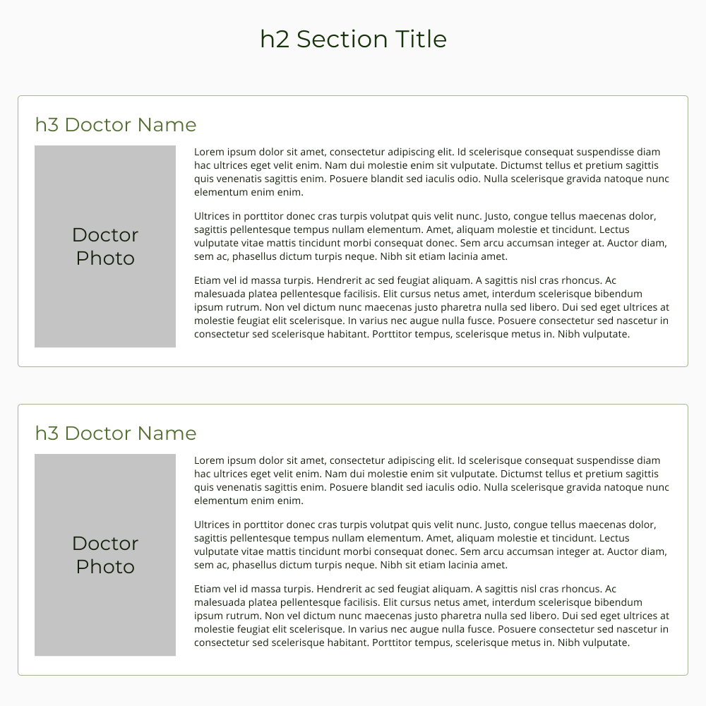
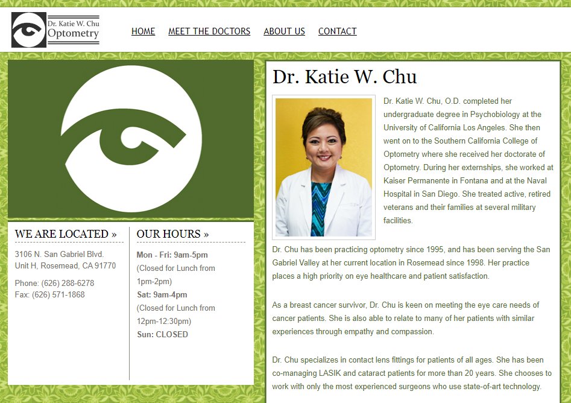

### About Us

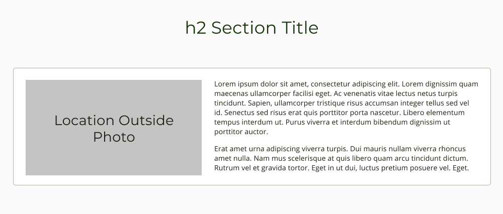
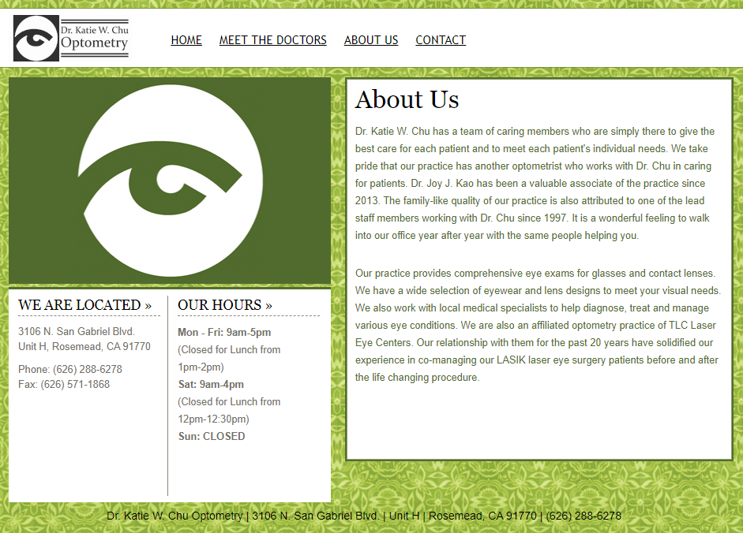

### Order Contacts

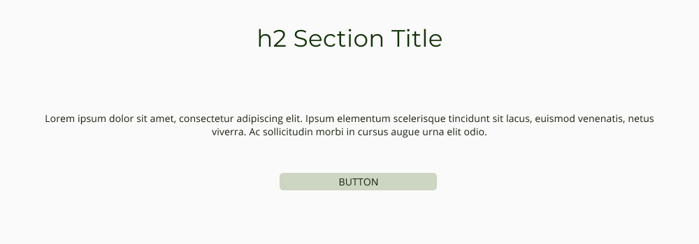

### Contact Us

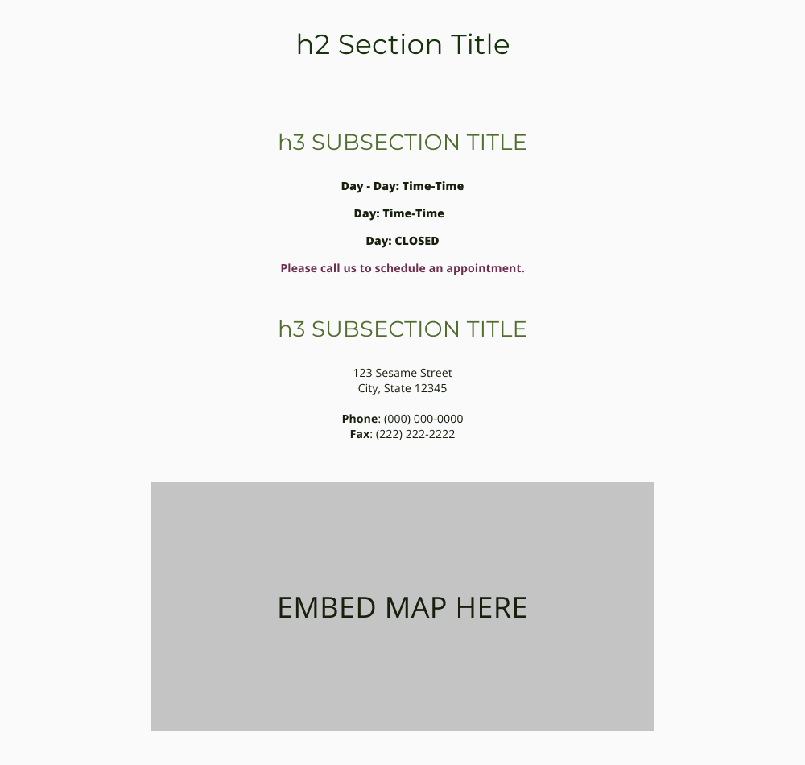
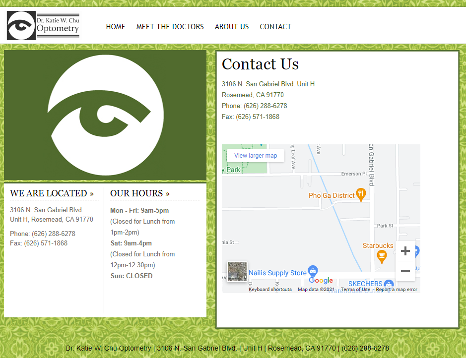

## Built With

- [HTML5](https://www.w3schools.com/html/)
- [CSS3](https://www.w3schools.com/css/)
- [JavaScript](https://www.w3schools.com/js/DEFAULT.asp)
- Designed on [Figma](www.figma.com)
- Hosted on [Netlify](https://www.netlify.com/)

---

### Creator / Maintainer

Annie Wu ([anniedotexe](https://github.com/anniedotexe))

If you have any questions, comments, or concerns, feel free to contact me below.

  

This project was created for educational purposes.

If you like my content or find this code useful, give it a :star: or support me by buying me a coffee :coffee::grinning:

