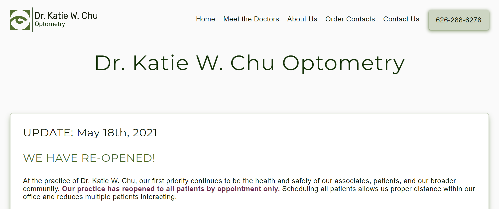

# An Optometry Practice Website's Redesign

This is a redesign of my optometrist's website to be responsive and have a modern minimalistic design (and look less early 2000's). 

This was created just for fun to practice my web development skills.
_I am not associated with nor speak for this optometry practice._

LIVE DEMO - [optometrist.anniew.xyz](https://optometrist.anniew.xyz/) OR [optometrist.netlify.app](https://optometrist.netlify.app/)

    
    
    
    

    

### Designed On
- 💜 [Figma](www.figma.com)

### Built With
- 💙 [HTML5](https://www.w3schools.com/html/)
- 💜 [CSS3](https://www.w3schools.com/css/)
- 💙 [JavaScript](https://www.w3schools.com/js/DEFAULT.asp)

### Hosted On
- 💜 [Netlify](https://www.netlify.com/)

---

### Creator / Maintainer

Annie Wu ([anniedotexe](https://github.com/anniedotexe))

If you have any questions about the code, feel free to contact me anywhere below.

  
  
  
  

This project was created for educational purposes.

If you like my content or find this code useful, give it a :star: or support me by buying me a coffee :coffee::grinning:

